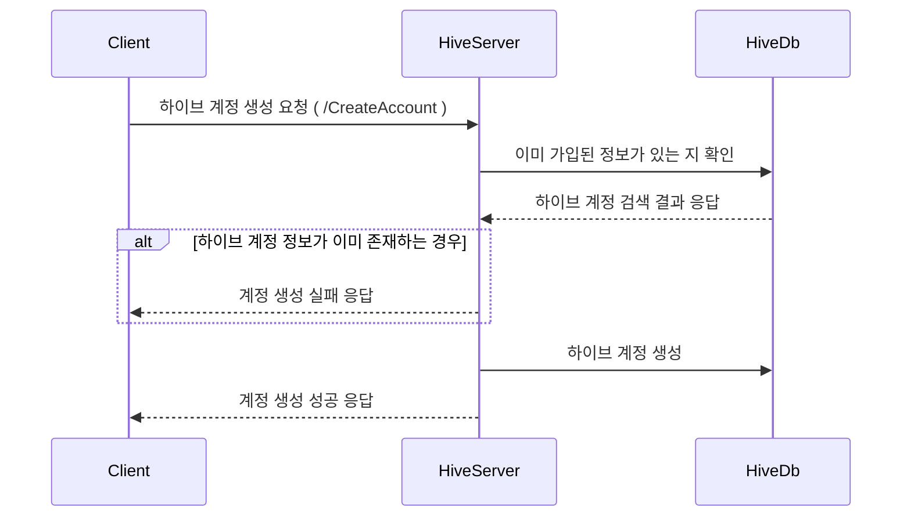
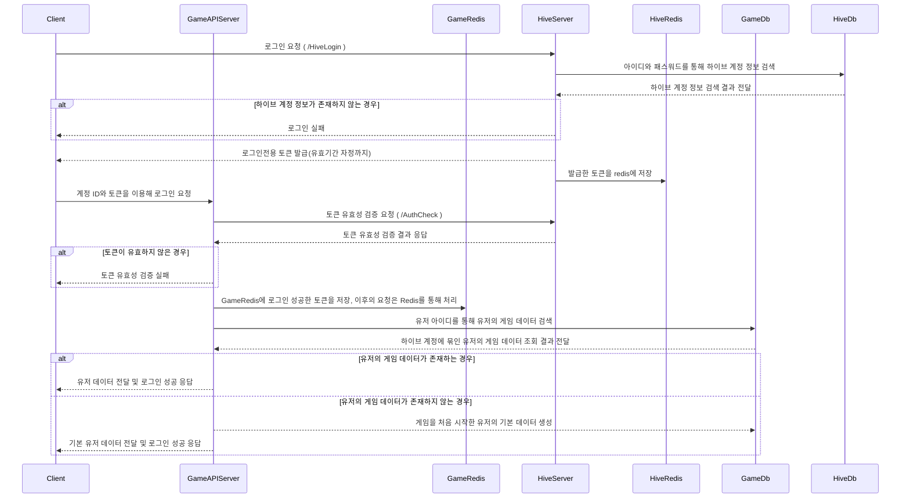
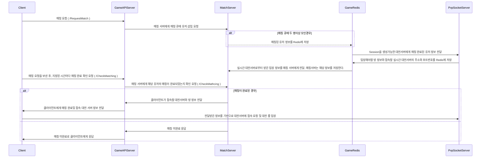

# 하이브 계정 생성

```mermaid
sequenceDiagram
    
    participant Client
    participant HiveServer
    participant HiveDb


    Client             ->> HiveServer:        하이브 계정 생성 요청 ( /CreateAccount )
    HiveServer         ->> HiveDb:            이미 가입된 정보가 있는 지 확인
    HiveDb            -->> HiveServer:        하이브 계정 검색 결과 응답
    alt 하이브 계정 정보가 이미 존재하는 경우
        HiveServer    -->> Client:            계정 생성 실패 응답
    end

    HiveServer         ->> HiveDb:            하이브 계정 생성
    HiveServer        -->> Client:            계정 생성 성공 응답

```

---

# 게임 API 서버 로그인

```mermaid
sequenceDiagram
    
    participant Client
    participant GameAPIServer
    participant GameRedis
    participant HiveServer
    participant HiveRedis
    participant GameDb
    participant HiveDb


    Client             ->> HiveServer:        로그인 요청 ( /HiveLogin )
    HiveServer         ->> HiveDb:            아이디와 패스워드를 통해 하이브 계정 정보 검색
    HiveDb            -->> HiveServer:        하이브 계정 정보 검색 결과 전달
    alt 하이브 계정 정보가 존재하지 않는 경우
        HiveServer    -->> Client:            로그인 실패
    end

    HiveServer        -->> Client:            로그인전용 토큰 발급(유효기간 자정까지)
    HiveServer         ->> HiveRedis:         발급한 토큰을 redis에 저장
    Client             ->> GameAPIServer:     계정 ID와 토큰을 이용해 로그인 요청
    GameAPIServer      ->> HiveServer:        토큰 유효성 검증 요청 ( /AuthCheck )
    HiveServer        -->> GameAPIServer:     토큰 유효성 검증 결과 응답
    alt 토큰이 유효하지 않은 경우
        GameAPIServer -->> Client:            토큰 유효성 검증 실패
    end

    GameAPIServer      ->> GameRedis:         GameRedis에 로그인 성공한 토큰을 저장, 이후의 요청은 Redis를 통해 처리
    GameAPIServer      ->> GameDb:            유저 아이디를 통해 유저의 게임 데이터 검색
    GameDb            -->> GameAPIServer:     하이브 계정에 묶인 유저의 게임 데이터 조회 결과 전달
    alt 유저의 게임 데이터가 존재하는 경우
        GameAPIServer -->> Client:            유저 데이터 전달 및 로그인 성공 응답
    else 유저의 게임 데이터가 존재하지 않는 경우
        GameAPIServer -->> GameDb:            게임을 처음 시작한 유저의 기본 데이터 생성
        GameAPIServer -->> Client:            기본 유저 데이터 전달 및 로그인 성공 응답
    end

```

---

# 게임 API 매칭 요청

```mermaid
sequenceDiagram
    
    participant Client
    participant GameAPIServer
    participant MatchServer
    participant GameRedis
    participant PvpSocketServer


    Client             ->> GameAPIServer:     매칭 요청 ( /RequestMatch )
    GameAPIServer      ->> MatchServer:       매칭 서버에게 매칭 큐에 유저 삽입 요청
    alt 매칭 큐에 두 명이상 모인경우 
        MatchServer    -->> GameRedis:        매칭된 유저 정보를 Redis에 저장
    end

    GameRedis          ->> PvpSocketServer:   Session을 생성가능한 대전서버에게 매칭 완료된 유저 정보 전달 
    PvpSocketServer    ->> GameRedis:         입장해야할 방 정보와 접속할 실시간 대전서버의 주소와 포트번호를 Redis에 저장
    GameRedis          ->> MatchServer:       실시간 대전서버로부터 받은 입장 정보를 매칭 서버에게 전달, 매칭서버는 해당 정보를 저장한다.


    Client             ->> GameAPIServer:     매칭 요청을 보낸 후, 지정된 시간마다 매칭 완료 확인 요청 ( /CheckMatching )
    GameAPIServer      ->> MatchServer:       매칭 서버에게 해당 유저의 매칭이 완료되었는지 확인 요청 ( /CheckMathcing )
    alt 매칭이 완료된 경우
        MatchServer    ->> GameAPIServer:     클라이언트가 접속할 대전서버와 방 정보 전달
        GameAPIServer  ->> Client:            클라이언트에게 매칭 완료및 접속 대전 서버 정보 전달
        Client ->> PvpSocketServer:           전달받은 정보를 기반으로 대전서버에 접속 요청 및 대전 룸 입장
    else
        MatchServer ->> GameAPIServer:        매칭 미완료 응답
        GameAPIServer  ->> Client:            매칭 미완료로 클라이언트에게 응답
    end

```

---

