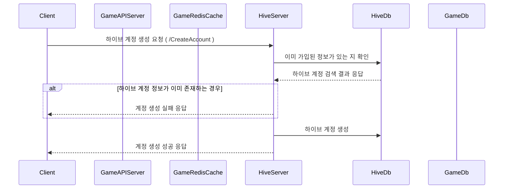
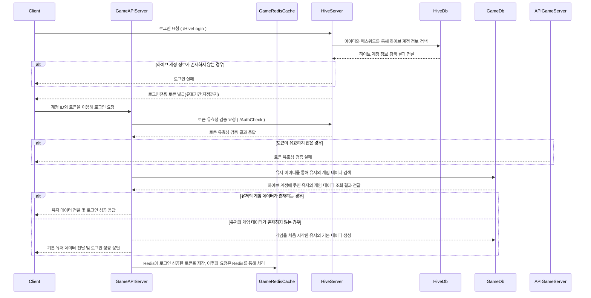

# 하이브 계정 생성

```mermaid
sequenceDiagram
    
    participant Client
    participant GameAPIServer
    participant GameRedisCache
    participant HiveServer
    participant HiveDb
    participant GameDb


    Client             ->> HiveServer:        하이브 계정 생성 요청 ( /CreateAccount )
    HiveServer         ->> HiveDb:            이미 가입된 정보가 있는 지 확인
    HiveDb            -->> HiveServer:        하이브 계정 검색 결과 응답
    alt 하이브 계정 정보가 이미 존재하는 경우
        HiveServer    -->> Client:            계정 생성 실패 응답
    end

    HiveServer         ->> HiveDb:            하이브 계정 생성
    HiveServer        -->> Client:            계정 생성 성공 응답

```

---

# 하이브 계정이 있는 유저의 게임 로그인

```mermaid
sequenceDiagram
    
    participant Client
    participant GameAPIServer
    participant GameRedisCache
    participant HiveServer
    participant HiveDb
    participant GameDb


    Client             ->> HiveServer:        로그인 요청 ( /HiveLogin )
    HiveServer         ->> HiveDb:            아이디와 패스워드를 통해 하이브 계정 정보 검색
    HiveDb            -->> HiveServer:        하이브 계정 정보 검색 결과 전달
    alt 하이브 계정 정보가 존재하지 않는 경우
        HiveServer    -->> Client:            로그인 실패
    end

    HiveServer        -->> Client:            로그인전용 토큰 발급(유효기간 자정까지)
    Client             ->> GameAPIServer:     계정 ID와 토큰을 이용해 로그인 요청
    GameAPIServer      ->> HiveServer:        토큰 유효성 검증 요청 ( /AuthCheck )
    HiveServer        -->> GameAPIServer:     토큰 유효성 검증 결과 응답
    alt 토큰이 유효하지 않은 경우
        APIGameServer -->> Client:            토큰 유효성 검증 실패
    end

    GameAPIServer      ->> GameDb:            유저 아이디를 통해 유저의 게임 데이터 검색
    GameDb            -->> GameAPIServer:     하이브 계정에 묶인 유저의 게임 데이터 조회 결과 전달
    alt 유저의 게임 데이터가 존재하는 경우
        GameAPIServer -->> Client:            유저 데이터 전달 및 로그인 성공 응답
    else 유저의 게임 데이터가 존재하지 않는 경우
        GameAPIServer -->> GameDb:            게임을 처음 시작한 유저의 기본 데이터 생성
        GameAPIServer -->> Client:            기본 유저 데이터 전달 및 로그인 성공 응답
    end
    GameAPIServer      ->> GameRedisCache:    Redis에 로그인 성공한 토큰을 저장, 이후의 요청은 Redis를 통해 처리
    
```

---

