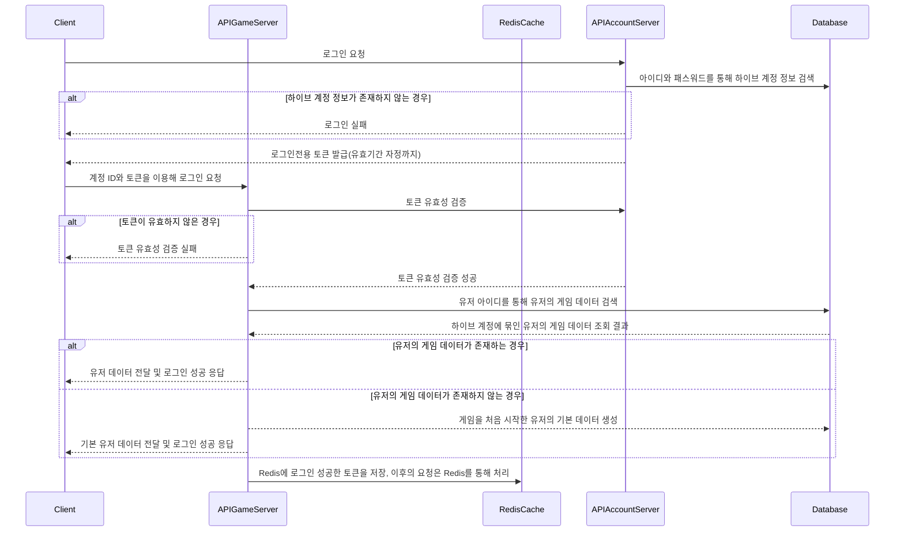

# 하이브 게정 생성

```mermaid
sequenceDiagram
    
    participant Client
    participant APIGameServer
    participant RedisCache
    participant APIAccountServer
    participant Database


    Client             ->> APIAccountServer:  하이브 계정 생성 요청
    APIAccountServer   ->> Database:          이미 가입된 정보가 있는 지 확인
    Database          -->> APIAccountServer:  하이브 계정 검색 결과 응답
    alt 하이브 계정 정보가 이미 존재하는 경우
    APIAccountServer  -->> Client:             계정 생성 실패 응답
    end

    APIAccountServer   ->> 
    APIAccountServer  -->> Client:            계정 생성 성공 응답

```


---


# 하이브 계정이 있는 유저의 게임 로그인



---


